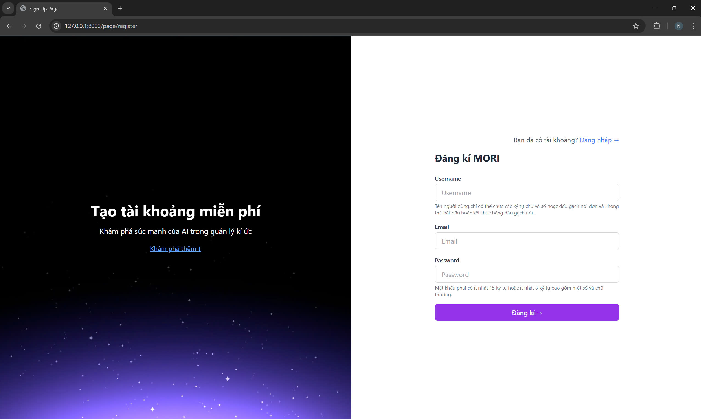

# 🌥️ Mori\_Cloud

**Mori\_Cloud** is a web platform that allows users to store, manage, and share memorable moments through images and text. Powered by artificial intelligence for smart image search, Mori\_Cloud delivers a personalized, secure, and modern user experience.

---

## 👨‍💻 Development Team

| Full Name            | Student ID |
| -------------------- | ---------- |
| Trần Xuân Diện       | 22650601   |
| Nguyễn Đăng Tuấn Huy | 22658341   |
| Võ Trọng Nhơn        | 22658441   |
| Đỗ Tấn Đạt           | 22648601   |
| Trần Phú Thọ         | 22653431   |

---

## ✨ Key Features

* 📁 **Image & Album Management**: Create, edit, categorize, and delete photos or albums.
* 🔍 **AI-based Image Search**: Use OpenCLIP + FAISS to search for images via text or similar images.
* 🌐 **Domain Deployment via Cloudflare**: Support for custom domains, CDN, SSL, and DNS security.
* 🐘 **PostgreSQL Integration**: A reliable and powerful relational database system.
* 🧠 **AI-powered Image Encoding**: Convert images and descriptions into vector format for fast retrieval.
* 🛡 **Secure Authentication**:

  * Google OAuth 2.0
  * Knox Token for API security
* 🧑‍🤝‍🧑 **Community Interaction**: Like, comment, and receive real-time notifications.
* 📤 **Cloud Storage Integration**: Upload images to private cloud using `Token_cloud`.
* 📧 **Email Verification & Password Reset**: Send emails via SMTP using `EMAIL_HOST_USER`.
* 🔍 **Search History Tracking**: Automatically saves and retrieves recent searches.
* 🛠 **Admin Dashboard**: Manage users, posts, and system analytics.

---

## 🛠 Installation & Usage

### 🔐 Create `.env` File

Create a `.env` file in the root directory and add:

```env
# Django secret key
KEY_DJANGO=django-insecure-6wdka9!o9k6$&x60p-sul9_+iz2#98q_1()_jv*fl+l8wavfr(

# Google OAuth2
GOOGLE_CLIENT_APPLICATION=
SECRET_GOOGLE_CLIENT_APPLICATION=

# Email SMTP
EMAIL_HOST_USER=
EMAIL_HOST_KEY_APPLICATON=

# PostgreSQL configuration
POSTGRES_USER=admin
POSTGRES_PASSWORD=morimori
POSTGRES_DB=postgres
POSTGRES_HOST=mori_db
POSTGRES_PORT=5432

# Cloud token
Token_cloud=
```

---

### 🧪 Run Locally (Without Docker)

1. **Clone the Repository**

```bash
git clone https://github.com/xndien2004/Mori_Cloud.git
cd Mori_Cloud/mori
```

2. **Create Virtual Environment & Install Dependencies**

```bash
# Windows
python -m venv venv
venv\Scripts\activate

# macOS/Linux
python3 -m venv venv
source venv/bin/activate

# Install packages
pip install -r requirements.txt
```

3. **Run Migrations & Start Server**

```bash
python manage.py makemigrations
python manage.py migrate
python manage.py runserver
```

> Access at: [http://localhost:8000](http://localhost:8000)

---

### 🐳 Build & Deploy with Docker

#### ⚙️ 1. Build and Run Containers

```bash
docker compose down -v
docker volume prune -f
docker compose up -d --build
```

#### 🌐 2. Access Application

Go to: [http://localhost:8000](http://localhost:8000)

---

## 📽 Demo Video

Watch full demo here: [📺 Mori\_Cloud Demo Video](https://drive.google.com/file/d/1Na6xqTnkFOgA56y_bOgjq7zBqYWO2WbP/view?usp=sharing)

---

## 🖼 Screenshots

### 1. Main Interfaces: Login, Register, Landing Page, Forgot Password, Profile Page

<table>
  <tr>
    <td align="center">
      <br>
      <em>Landing Page</em>
    </td>
    <td align="center">
      <br>
      <em>Login</em>
    </td>
    <td align="center">
      <br>
      <em>Register</em>
    </td>
  </tr>
  <tr>
    <td align="center">
      <br>
      <em>Forgot Password</em>
    </td>
    <td align="center">
      <br>
      <em>User Profile</em>
    </td>
  </tr>
</table>

---

### 2. Home Page Overview

<div align="center">
  <br>
  <em style="color: gray;">Home after login</em>
</div>

---

### 3. Photo Management

<table>
  <tr>
    <td align="center">
      <br>
      <em>Overview of photos and albums</em>
    </td>
    <td align="center">
      <br>
      <em>Photo management interface</em>
    </td>
  </tr>
</table>

---

### 4. Album Management

<table>
  <tr>
    <td align="center">
      <br>
      <em>Album list</em>
    </td>
    <td align="center">
      <br>
      <em>Create new album</em>
    </td>
  </tr>
</table>

---

### 5. Trash Bin

<div align="center">
  <br>
  <em style="color: gray;">Trash Bin – Manage deleted images</em>
</div>

---

### 6. Regular & AI Search, Search History

<table>
  <tr>
    <td align="center">
      <br>
      <em>Regular search</em>
    </td>
    <td align="center">
      <br>
      <em>AI-based search</em>
    </td>
    <td align="center">
      <br>
      <em>Search history</em>
    </td>
  </tr>
</table>

---

### 7. Community Interaction (Like, Comment, Notification)

<table>
  <tr>
    <td align="center">
      <br>
      <em>Post feed</em>
    </td>
    <td align="center">
      <br>
      <em>Comment, reply, like</em>
    </td>
    <td align="center">
      <br>
      <em>Interaction notifications</em>
    </td>
  </tr>
</table>

---

### 8. Admin Management

<table>
  <tr>
    <td align="center">
      <br>
      <em>Admin Dashboard</em>
    </td>
    <td align="center">
      <br>
      <em>User Management</em>
    </td>
    <td align="center">
      <br>
      <em>Post Management</em>
    </td>
  </tr>
</table>
